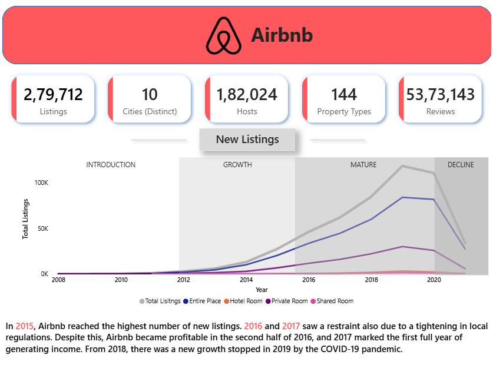
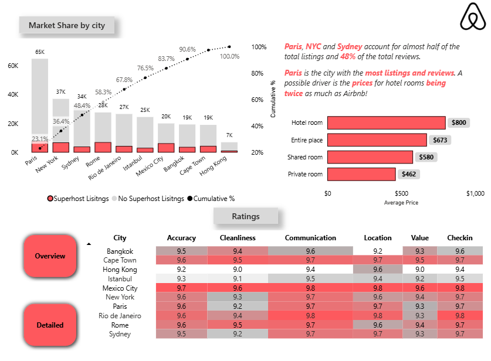

# Airbnb Market & Ratings Analysis Dashboard

## Overview

An interactive Power BI dashboard built to analyze Airbnb listings across major cities. The dashboard presents listing trends, market share, pricing, property types, host information, and customer ratings through a clean and executive-friendly visual design.

## Dashboard Preview

### Overview

### Ratings

## Key Analysis

- Total Listings
- Distinct Cities
- Hosts
- Property Types
- Reviews
- New Listings and yearly growth trends
- Market Share by City
- Superhost vs. Non-Superhost Listings
- Average Price by Room Type
- City-wise Ratings across Accuracy, Cleanliness, Communication, Location, Value, and Check-in

## Tools Used

- Power BI
- Power Query
- DAX
- Data Cleaning & Transformation
- Data Visualization

## Dataset

The dataset used in this project is **publicly available data** and is used for analytical and educational purposes.

> **Disclaimer:** This project does **not** use Airbnb's confidential, proprietary, or internal company data. The analysis is based entirely on publicly available data and is not an official Airbnb report or representation.

## Project Purpose

The purpose of this project is to demonstrate how publicly available Airbnb data can be transformed into an interactive Power BI dashboard to explore listing trends, pricing, city-level market share, and customer ratings.
